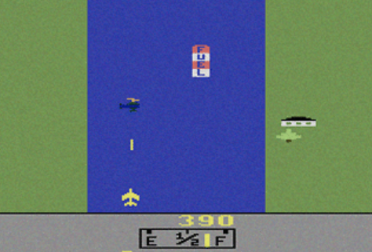

# RiverRaid Documentation

This folder contains project documentation for **RiverRaid** (2D single-player web game with realtime authoritative backend).

## Demo

[](./demo/recording-2026-03-12T04-05-59-348Z.webm)

## Docs Index

- [Game Vision](./game-vision.md)
- [System Design](./system_design.md)
- [MVP Scope](./mvp-scope.md)
- [Technical Architecture](./technical-architecture.md)
- [Realtime Protocol](./realtime-protocol.md)
- [Data Model](./data-model.md)
- [HTTP API](./api-http.md)
- [Login Cache Service](./login-cache-service.md)
- [Roadmap](./roadmap.md)

## Current Focus

- Phase 0 backend is implemented: config-auth, JWT login, WebSocket join validation, and Docker runtime.
- Server-authoritative single-player session loop is active over WebSocket.
- Protocol and HTTP contracts are test-covered for current behavior.
- Persistence and cache services are not implemented yet.

## Docker Quick Start (Phase 0)

Run backend:

```bash
docker compose up --build backend
```

Run unit tests in container:

```bash
docker compose run --rm tests
```

Runtime endpoints:
- Demo page: `http://localhost:8000/`
- HTTP health: `http://localhost:8000/healthz`
- HTTP login: `POST http://localhost:8000/api/v1/auth/login`
- WebSocket: `ws://localhost:8000/ws`
